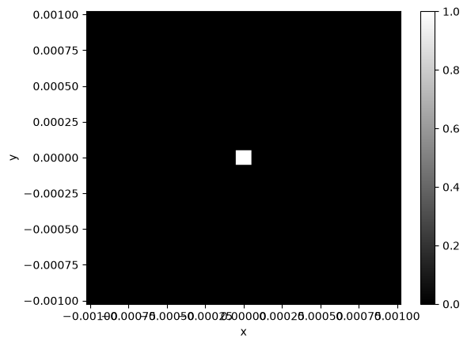
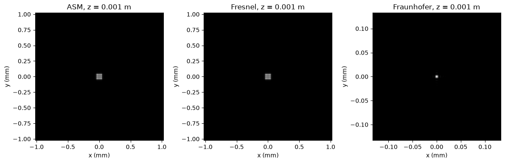
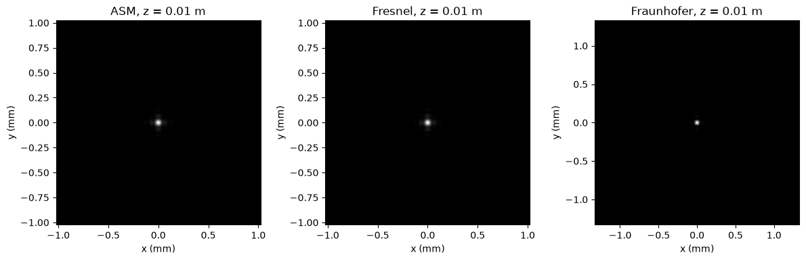
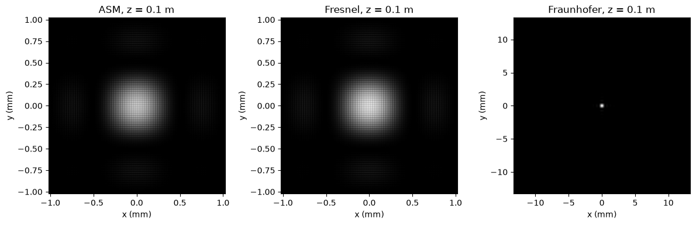
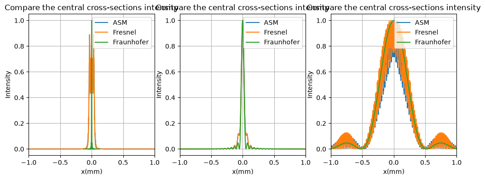
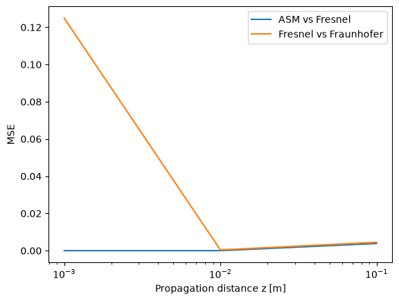

# Introduction

::: {.callout-note title="Runnable code"}
The code is organized by responsibility:

- Propagation models: [`asm.py`](../numerical-simulation/wave_optics/propagation/asm.py), [`fresnel_tf.py`](../numerical-simulation/wave_optics/propagation/fresnel_tf.py), [`fresnel_fft.py`](../numerical-simulation/wave_optics/propagation/fresnel_fft.py), and [`fraunhofer.py`](../numerical-simulation/wave_optics/propagation/fraunhofer.py).
- Shared spatial, frequency, and wavevector grids: [`grids.py`](../numerical-simulation/wave_optics/grids.py).
- Complete runnable experiment and plotting workflow: [`three-propagation-models-clean-version.py`](../numerical-simulation/three-propagation-models-clean-version.py).
:::

Light is fundamentally an electromagnetic wave. Its behavior is governed by Maxwell’s equations, which describe how electric and magnetic fields evolve and interact in space and time. In a homogeneous, source-free medium, Maxwell’s equations lead to the electromagnetic wave equation,

$$
\nabla^2 \mathbf{E}
-
\mu\epsilon
\frac{\partial^2 \mathbf{E}}{\partial t^2}
=0,
$$

where $\mathbf{E}$ is the electric field, and $\mu$ and $\epsilon$ are the permeability and permittivity of the medium.

For many problems in physical optics, polarization effects are not the main concern, and the optical field can be treated using a scalar approximation. For monochromatic light, the time dependence can be separated from the spatial field,

$$
E(\mathbf r,t)
=
\operatorname{Re}
\left\{
U(\mathbf r)e^{-i\omega t}
\right\},
$$

where $U(\mathbf r)$ is the complex spatial amplitude. Substituting this form into the wave equation gives the Helmholtz equation,

$$
\nabla^2 U+k^2U=0,
$$

with

$$
k=\frac{2\pi}{\lambda}.
$$

The Helmholtz equation therefore provides the basic mathematical description of monochromatic wave propagation in a homogeneous medium.

A central problem in wave optics can then be stated as follows: if the complex optical field is known on one plane,

$$
U(x,y,0),
$$

how can the field

$$
U(x,y,z)
$$

be determined after propagating a distance $z$?

Unlike the rays used in geometrical optics, a wavefront cannot generally be propagated by simply moving each point forward along a straight line. Different parts of the wavefront contribute to the optical field at later positions, and these contributions interfere with one another. This behavior gives rise to diffraction.

One intuitive description of diffraction is provided by the Huygens–Fresnel principle. Each point on a wavefront can be regarded as contributing a secondary wave, and the field at a later position results from the coherent superposition of all these contributions. This idea leads to scalar diffraction integrals that describe how an optical field propagates between two planes.

If the optical field on the input plane is $U_0(x',y')$, the field at an observation point depends on contributions from all points on the input plane.

A general scalar diffraction expression therefore has the form
$$
U(P)
\propto
\iint
U_0(Q)
\frac{e^{ikr}}{r}
\,dS,
$$
where $r$ is the distance between a source point $Q$ and an observation point $P$.

The factor
$$
\frac{e^{ikr}}{r}
$$
represents the propagation of a spherical wave: its phase changes with distance through $e^{ikr}$, while its amplitude decreases approximately as $1/r$.

This diffraction integral describes wave propagation physically, but its exact form is not always convenient for analytical or numerical calculation. This motivates the introduction of approximations.

When the propagation angles are small enough for the paraxial approximation to hold, the diffraction integral can be reduced to the Fresnel diffraction model. If the propagation distance is increased further so that the observation plane lies in the far-field regime, an additional approximation produces the Fraunhofer diffraction model.

This gives an approximate hierarchy,

$$
\text{scalar diffraction}
\longrightarrow
\text{Fresnel diffraction}
\longrightarrow
\text{Fraunhofer diffraction},
$$

where each step introduces stronger assumptions in exchange for a simpler mathematical description.

There is also another way to describe propagation that begins directly from the Helmholtz equation. Instead of regarding the field as a collection of secondary spherical waves, the angular spectrum approach decomposes the field into plane-wave components. This is the basis of the Angular Spectrum Method.

Fresnel, Fraunhofer, and angular-spectrum propagation therefore describe the same general physical problem—how an optical wave evolves through free space—but from different mathematical perspectives and under different assumptions.

The distinction becomes especially important in computational optics. Continuous diffraction integrals and Fourier transforms must be represented on finite, discrete numerical grids. Spatial sampling, Fourier-frequency coordinates, propagation distance, computational window size, FFT conventions, and approximation validity all affect whether a numerical result actually represents the intended physical system.

The purpose of this article is therefore not only to present the formulas for Fresnel, Fraunhofer, and Angular Spectrum propagation, but to turn each model into a numerical implementation and examine how the underlying physical assumptions appear in practice. The implementations will be tested with simple optical fields, visualized through numerical diffraction experiments, and used to discuss several common problems encountered when translating wave-optics equations into code.

# Part II — From Equations to Algorithms

The three propagation models introduced above describe the same task:

$$
U_0(x',y')
\longrightarrow
U(x,y,z),
$$

but they arrive at the propagated field in different ways.

For Fresnel and Fraunhofer diffraction, we begin from the scalar diffraction picture and progressively introduce approximations. For the Angular Spectrum Method, we instead decompose the input field into plane-wave components and propagate each component independently.

The purpose of this section is not to reproduce a complete diffraction-theory derivation, but to follow each model far enough that its numerical implementation follows naturally from the mathematics.

## 2.1 Fresnel Diffraction

Consider a point $(x',y',0)$ on the input plane and a point $(x,y,z)$ on the observation plane. Their separation is

$$
r=
\sqrt{
z^2+(x-x')^2+(y-y')^2
}.
$$

In scalar diffraction theory, propagation contains the spherical-wave factor

$$
\frac{e^{ikr}}{r}.
$$

The difficulty is that $r$ contains a square root coupling the source and observation coordinates.

If the field mainly propagates close to the optical axis,

$$
(x-x')^2+(y-y')^2 \ll z^2,
$$

we can write

$$
r
=
z
\sqrt{
1+
\frac{(x-x')^2+(y-y')^2}{z^2}
}
$$

and apply

$$
\sqrt{1+\epsilon}
\approx
1+\frac{\epsilon}{2}.
$$

This gives

$$
r
\approx
z+
\frac{(x-x')^2+(y-y')^2}{2z}.
$$

This is the key Fresnel approximation.

Substituting it into the propagation phase,

$$
e^{ikr}
\approx
e^{ikz}
\exp
\left[
i\frac{k}{2z}
\left(
(x-x')^2+(y-y')^2
\right)
\right].
$$

The Fresnel diffraction integral becomes

$$
U(x,y,z)
=
\frac{e^{ikz}}{i\lambda z}
\iint
U_0(x',y')
\exp
\left[
i\frac{k}{2z}
\left(
(x-x')^2+(y-y')^2
\right)
\right]
dx'dy'.
$$

This equation already defines Fresnel propagation. Numerically, however, evaluating the integral separately for every output pixel would be expensive.

A more useful computational form can be obtained in the spatial-frequency domain.

For a plane-wave component with transverse wavevector $(k_x,k_y)$,

$$
k_z
=
\sqrt{k^2-k_x^2-k_y^2}.
$$

Under the same paraxial condition,

$$
k_x^2+k_y^2 \ll k^2,
$$

we expand

$$
k_z
=
k
\sqrt{
1-
\frac{k_x^2+k_y^2}{k^2}
}
$$

as

$$
k_z
\approx
k-
\frac{k_x^2+k_y^2}{2k}.
$$

Therefore,

$$
e^{ik_z z}
\approx
e^{ikz}
\exp
\left[
-i
\frac{z}{2k}
(k_x^2+k_y^2)
\right].
$$

Using

$$
k_x=2\pi f_x,
\qquad
k_y=2\pi f_y,
\qquad
k=\frac{2\pi}{\lambda},
$$

the Fresnel transfer function becomes

$$
\boxed{
H_F(f_x,f_y;z)
=
e^{ikz}
\exp
\left[
-i\pi\lambda z
(f_x^2+f_y^2)
\right]
}.
$$

Propagation can therefore be computed as

$$
\boxed{
U(x,y,z)
=
\mathcal F^{-1}
\left\{
\mathcal F[U_0(x,y)]
H_F(f_x,f_y;z)
\right\}.
}
$$

This form is particularly convenient numerically because the propagation operation becomes:

$$
\text{FFT}
\rightarrow
\text{multiply by propagation phase}
\rightarrow
\text{inverse FFT}.
$$

A minimal implementation is:

```python
def fresnel_tf(U0, z, wavelength, dx, dy):
    Ny, Nx = U0.shape
    k = 2 * np.pi / wavelength

    fx = np.fft.fftfreq(Nx, d=dx)
    fy = np.fft.fftfreq(Ny, d=dy)
    FX, FY = np.meshgrid(fx, fy)

    H = (
        np.exp(1j * k * z)
        * np.exp(
            -1j * np.pi * wavelength * z
            * (FX**2 + FY**2)
        )
    )

    U0_f = np.fft.fft2(U0)
    Uz = np.fft.ifft2(U0_f * H)

    return Uz
```

The code mirrors the equation directly. `fft2` decomposes the input field into spatial-frequency components, `H` gives each component the phase accumulated during Fresnel propagation, and `ifft2` reconstructs the propagated field.

The maintained transfer-function implementation is in [`propagation/fresnel_tf.py`](../numerical-simulation/wave_optics/propagation/fresnel_tf.py). A scaled single-FFT formulation, which returns its own physical output coordinates, is available separately in [`propagation/fresnel_fft.py`](../numerical-simulation/wave_optics/propagation/fresnel_fft.py).

---

## 2.2 Fraunhofer Diffraction

Fraunhofer diffraction is not an independent starting model. It is obtained by making an additional approximation to Fresnel diffraction.

Starting again from

$$
U(x,y,z)
=
\frac{e^{ikz}}{i\lambda z}
\iint
U_0(x',y')
\exp
\left[
i\frac{k}{2z}
\left(
(x-x')^2+(y-y')^2
\right)
\right]
dx'dy',
$$

expand the quadratic terms:

$$
(x-x')^2
=
x^2+x'^2-2xx',
$$

$$
(y-y')^2
=
y^2+y'^2-2yy'.
$$

The field becomes

$$
U(x,y,z)
=
\frac{e^{ikz}}{i\lambda z}
e^{
i\frac{k}{2z}(x^2+y^2)
}
\iint
U_0(x',y')
e^{
i\frac{k}{2z}(x'^2+y'^2)
}
e^{
-i\frac{2\pi}{\lambda z}
(xx'+yy')
}
dx'dy'.
$$

In the far field, the quadratic phase variation across the input aperture,

$$
\exp
\left[
i\frac{k}{2z}
(x'^2+y'^2)
\right],
$$

becomes sufficiently small that it may be approximated as

$$
\exp
\left[
i\frac{k}{2z}
(x'^2+y'^2)
\right]
\approx 1.
$$

The remaining integral is

$$
U(x,y,z)
\approx
\frac{e^{ikz}}{i\lambda z}
e^{
i\frac{k}{2z}(x^2+y^2)
}
\iint
U_0(x',y')
e^{
-i2\pi
\left(
\frac{x}{\lambda z}x'
+
\frac{y}{\lambda z}y'
\right)
}
dx'dy'.
$$

This has exactly the form of a two-dimensional Fourier transform.

Therefore,

$$
\boxed{
U(x,y,z)
\approx
\frac{e^{ikz}}{i\lambda z}
e^{
i\frac{k}{2z}(x^2+y^2)
}
\,
\mathcal F
\{U_0(x',y')\}
\bigg|_{
f_x=x/(\lambda z),
\,
f_y=y/(\lambda z)
}
}.
$$

This is the central result of Fraunhofer diffraction:

$$
\boxed{
\text{far-field diffraction pattern}
\leftrightarrow
\text{Fourier transform of the input field}.
}
$$

Numerically, this makes Fraunhofer propagation particularly simple:

```python
def fraunhofer(U0, z, wavelength, dx, dy):
    Ny, Nx = U0.shape
    k = 2 * np.pi / wavelength

    fx = np.fft.fftshift(
        np.fft.fftfreq(Nx, d=dx)
    )
    fy = np.fft.fftshift(
        np.fft.fftfreq(Ny, d=dy)
    )

    x_out = wavelength * z * fx
    y_out = wavelength * z * fy
    X_out, Y_out = np.meshgrid(x_out, y_out)

    spectrum = (
        np.fft.fftshift(
            np.fft.fft2(
                np.fft.ifftshift(U0)
            )
        )
        * dx * dy
    )

    prefactor = (
        np.exp(1j * k * z)
        / (1j * wavelength * z)
        * np.exp(
            1j * k
            / (2 * z)
            * (X_out**2 + Y_out**2)
        )
    )

    Uz = prefactor * spectrum

    return Uz, x_out, y_out
```

The maintained implementation is in [`propagation/fraunhofer.py`](../numerical-simulation/wave_optics/propagation/fraunhofer.py).

There is an important numerical detail here.

The FFT produces samples in spatial-frequency coordinates,

$$
(f_x,f_y),
$$

but Fraunhofer diffraction maps those frequencies to physical output coordinates through

$$
\boxed{
x=\lambda z f_x,
\qquad
y=\lambda z f_y.
}
$$

Therefore, unlike the transfer-function implementation of Fresnel propagation, the Fraunhofer output plane does not automatically use the same physical pixel spacing as the input plane.

Its output sampling is

$$
\Delta x_{\text{out}}
=
\frac{\lambda z}{N_x\Delta x_{\text{in}}},
$$

and similarly for $y$.

This coordinate scaling becomes important when the three propagation methods are compared numerically.

---

## 2.3 Angular Spectrum Method

The Angular Spectrum Method approaches propagation from a different direction.

Instead of treating each point on the input plane as a secondary spherical-wave source, we represent the complete optical field as a superposition of plane waves.

The input field can be written as

$$
U(x,y,0)
=
\iint
A(k_x,k_y)
e^{i(k_xx+k_yy)}
dk_xdk_y,
$$

where

$$
A(k_x,k_y)
=
\mathcal F\{U(x,y,0)\}
$$

is the angular spectrum.

For every plane-wave component,

$$
\mathbf k
=
(k_x,k_y,k_z)
$$

must satisfy the Helmholtz dispersion relation

$$
k_x^2+k_y^2+k_z^2=k^2.
$$

Therefore,

$$
\boxed{
k_z
=
\sqrt{k^2-k_x^2-k_y^2}.
}
$$

After propagating a distance $z$, that plane wave acquires the phase

$$
e^{ik_z z}.
$$

Thus the propagated angular spectrum is

$$
A(k_x,k_y;z)
=
A(k_x,k_y;0)
e^{ik_z z}.
$$

Transforming back to real space gives

$$
\boxed{
U(x,y,z)
=
\mathcal F^{-1}
\left\{
\mathcal F[U(x,y,0)]
\,
e^{
iz\sqrt{k^2-k_x^2-k_y^2}
}
\right\}.
}
$$

The corresponding transfer function is therefore

$$
\boxed{
H_{\mathrm{ASM}}(k_x,k_y;z)
=
e^{
iz\sqrt{k^2-k_x^2-k_y^2}
}.
}
$$

Unlike the Fresnel transfer function, no paraxial expansion of $k_z$ has been made here.

The implementation again follows the same FFT–multiply–IFFT pattern:

```python
def asm(U0, z, wavelength, dx, dy):
    Ny, Nx = U0.shape

    k = 2 * np.pi / wavelength

    fx = np.fft.fftfreq(Nx, d=dx)
    fy = np.fft.fftfreq(Ny, d=dy)

    kx = 2 * np.pi * fx
    ky = 2 * np.pi * fy

    KX, KY = np.meshgrid(kx, ky)

    KZ = np.sqrt(
        k**2 - KX**2 - KY**2 + 0j
    )

    H = np.exp(1j * KZ * z)

    U0_f = np.fft.fft2(U0)
    Uz = np.fft.ifft2(U0_f * H)

    return Uz
```

The maintained implementation is in [`propagation/asm.py`](../numerical-simulation/wave_optics/propagation/asm.py).

The `+ 0j` in the square root is intentional.

When

$$
k_x^2+k_y^2\leq k^2,
$$

$k_z$ is real and the corresponding component is a propagating plane wave.

When

$$
k_x^2+k_y^2>k^2,
$$

$k_z$ becomes imaginary. Writing

$$
k_z=i\alpha,
$$

the propagation factor becomes

$$
e^{ik_z z}
=
e^{-\alpha z}.
$$

These are evanescent components, which decay exponentially with propagation distance rather than carrying energy into the far field.

For ordinary free-space propagation sampled at micrometer-scale pixel sizes, these components are often outside the accessible numerical bandwidth or become negligible very quickly. Nevertheless, treating $k_z$ as complex prevents an incorrect square root of a negative real number.

---

## 2.4 The Three Algorithms Side by Side

The mathematical differences between the three methods can now be seen directly from their computational forms.

For the Angular Spectrum Method,

$$
U_z
=
\mathcal F^{-1}
\left[
\mathcal F(U_0)
e^{ik_z z}
\right],
$$

with

$$
k_z=
\sqrt{k^2-k_x^2-k_y^2}.
$$

For Fresnel propagation, the same longitudinal wavevector is approximated as

$$
k_z
\approx
k-
\frac{k_x^2+k_y^2}{2k},
$$

giving

$$
U_z
=
\mathcal F^{-1}
\left[
\mathcal F(U_0)
e^{ikz}
e^{-i\pi\lambda z(f_x^2+f_y^2)}
\right].
$$

For Fraunhofer diffraction, an additional far-field approximation reduces propagation to a scaled Fourier transform,

$$
U_z(x,y)
\propto
\mathcal F\{U_0\}
\left(
\frac{x}{\lambda z},
\frac{y}{\lambda z}
\right).
$$

This exposes the relationship between the three models:

$$
\boxed{
\text{ASM}
\overset{\text{paraxial approximation}}{\longrightarrow}
\text{Fresnel}
\overset{\text{far-field approximation}}{\longrightarrow}
\text{Fraunhofer}.
}
$$

Their Python implementations are therefore not merely three unrelated algorithms. They encode increasingly restrictive physical approximations to the same wave-propagation problem.

# Part III — Numerical Experiments and Comparison

After deriving the three propagation models, the next step is to compare them under the same numerical conditions.

Rather than choosing a different example for each method, we define one optical field and propagate it using Fresnel, Fraunhofer, and Angular Spectrum propagation. The wavelength, input field, sampling interval, computational window, and propagation distance are kept unchanged. The only quantity that changes is the propagation model itself.

This makes it possible to observe directly how the approximations introduced in the previous section affect the numerical result.

## 3.1 Common Numerical Setup

A simple aperture is used as the input field because its diffraction behavior is easy to interpret.

For example, consider a rectangular aperture,

$$
U_0(x,y)
=
\operatorname{rect}\left(\frac{x}{a_x}\right)
\operatorname{rect}\left(\frac{y}{a_y}\right).
$$

The field is sampled on a finite grid,

$$
N_x \times N_y,
$$

with sampling intervals

$$
\Delta x,\qquad \Delta y.
$$

The physical size of the simulation window is therefore

$$
L_x=N_x\Delta x,
\qquad
L_y=N_y\Delta y.
$$

A representative numerical configuration is

```python
Nx = 1024
Ny = 1024

dx = 2e-6
dy = 2e-6

wavelength = 532e-9

ax = 100e-6
ay = 100e-6
```

The coordinate grid is constructed as

```python
x = (np.arange(Nx) - Nx // 2) * dx
y = (np.arange(Ny) - Ny // 2) * dy

X, Y = np.meshgrid(x, y)
```

and the aperture field is

```python
U0 = (
    (np.abs(X) <= ax / 2)
    & (np.abs(Y) <= ay / 2)
).astype(float)
```

The same `U0` is passed to all three propagation functions.

{fig-alt="A binary square aperture centred on the numerical grid."}


---

## 3.2 Changing Only the Propagation Method

For a given propagation distance $z$, the three fields are calculated as

```python
U_asm = asm(
    U0,
    z,
    wavelength,
    dx,
    dy,
)

U_fresnel = fresnel_tf(
    U0,
    z,
    wavelength,
    dx,
    dy,
)

U_fraunhofer, x_far, y_far = fraunhofer(
    U0,
    z,
    wavelength,
    dx,
    dy,
)
```

The corresponding intensities are

$$
I(x,y)=|U(x,y)|^2.
$$

For visualization, normalized intensity is useful:

```python
I_asm = np.abs(U_asm) ** 2
I_asm /= I_asm.max()

I_fresnel = np.abs(U_fresnel) ** 2
I_fresnel /= I_fresnel.max()

I_fraunhofer = np.abs(U_fraunhofer) ** 2
I_fraunhofer /= I_fraunhofer.max()
```

Normalization removes absolute intensity scaling and makes the spatial structure of the three diffraction patterns easier to compare.

However, it should be kept in mind that normalization also removes information about absolute power and propagation-dependent amplitude scaling. It is therefore appropriate for comparing diffraction-pattern shape, but not for validating energy conservation or absolute irradiance.

---

## 3.3 Comparing Different Propagation Distances

The comparison becomes more informative when the same experiment is repeated at several propagation distances.

For example,

```python
z_list = [
    1e-3,
    10e-3,
    100e-3,
]
```

corresponding to

$$
z=
1\ \mathrm{mm},
\qquad
10\ \mathrm{mm},
\qquad
100\ \mathrm{mm}.
$$

At every distance, the initial field remains unchanged:

$$
U_0(x,y).
$$

Only the propagation distance and propagation operator determine the resulting field.

Conceptually, the experiment is therefore

$$
U_0
\xrightarrow[\text{same }z]{\text{ASM}}
U_{\mathrm{ASM}},
$$

$$
U_0
\xrightarrow[\text{same }z]{\text{Fresnel}}
U_{\mathrm{Fresnel}},
$$

and

$$
U_0
\xrightarrow[\text{same }z]{\text{Fraunhofer}}
U_{\mathrm{Fraunhofer}}.
$$

The results can then be displayed side by side for each value of $z$.

This directly tests the approximation hierarchy discussed earlier.

At propagation conditions where the field remains paraxial, Fresnel propagation should approach the ASM result,

$$
U_{\mathrm{Fresnel}}
\approx
U_{\mathrm{ASM}}.
$$

As the propagation distance enters the far-field regime, the Fresnel diffraction pattern should increasingly approach the Fraunhofer result,

$$
I_{\mathrm{Fresnel}}
\approx
I_{\mathrm{Fraunhofer}}.
$$

The important point is that these agreements are not properties of the algorithms themselves. They occur only when the physical assumptions used to derive the approximations are satisfied.

{fig-alt="ASM, Fresnel, and Fraunhofer intensity patterns at one millimetre."}

{fig-alt="ASM, Fresnel, and Fraunhofer intensity patterns at ten millimetres."}

{fig-alt="ASM, Fresnel, and Fraunhofer intensity patterns at one hundred millimetres."}

---

## 3.4 Identifying the Fresnel and Fraunhofer Regimes

Propagation distance alone does not determine whether a field is in the near field or far field. The relevant scale also depends on the aperture size and wavelength.

A useful dimensionless quantity is the Fresnel number,

$$
\boxed{
N_F=\frac{a^2}{\lambda z}
}
$$

where $a$ represents a characteristic transverse size of the aperture.

Roughly,

$$
N_F\gtrsim 1
$$

corresponds to a regime where Fresnel diffraction effects are important, whereas

$$
N_F\ll1
$$

indicates the far-field regime in which Fraunhofer diffraction becomes valid.

Equivalently, a characteristic diffraction distance is

$$
z_{\mathrm{diff}}
\sim
\frac{a^2}{\lambda}.
$$

This provides a useful way to choose the propagation distances before performing the numerical experiment.

Instead of choosing arbitrary values of $z$, the distances can be selected relative to this characteristic scale:

$$
z\ll z_{\mathrm{diff}},
$$

$$
z\sim z_{\mathrm{diff}},
$$

and

$$
z\gg z_{\mathrm{diff}}.
$$

The three numerical experiments then correspond approximately to near-field, transitional, and far-field propagation.

---

## 3.5 Comparing the Results

The comparison should not rely only on two-dimensional images.

A useful first step is to compare the central cross-sections,

$$
I(x,y=0),
$$

for all three propagation methods.

For example,

```python
mid = Ny // 2

plt.plot(
    x,
    I_asm[mid],
    label="ASM",
)

plt.plot(
    x,
    I_fresnel[mid],
    label="Fresnel",
)
```

This makes small differences in peak position, diffraction-lobe width, and side-lobe structure easier to see than in a two-dimensional intensity image.

For Fraunhofer propagation, however, there is an additional coordinate issue.

The FFT output corresponds to spatial frequencies,

$$
f_x,
$$

which are mapped onto the observation plane through

$$
x_{\mathrm{far}}
=
\lambda z f_x.
$$

Therefore, the native Fraunhofer coordinates are generally different from the input grid used by the transfer-function Fresnel and ASM implementations.

This means that arrays should not be compared simply by matching pixel indices.

Instead, the comparison must be performed in physical coordinates.

For example, the Fraunhofer profile can be interpolated onto the same physical $x$-coordinates used for the Fresnel result before computing a quantitative error.

Spatial and frequency coordinates are created in [`grids.py`](../numerical-simulation/wave_optics/grids.py).

This distinction is easy to miss: two arrays can have the same number of pixels while representing completely different physical positions.

{fig-alt="Three panels comparing central intensity profiles at three propagation distances."}

---

## 3.6 From Visual Comparison to Quantitative Comparison

A visual comparison can show whether two diffraction patterns appear similar, but a numerical comparison provides stronger evidence.

One simple metric is the normalized mean-squared error,

$$
\mathrm{MSE}
=
\frac{1}{N}
\sum_{n=1}^{N}
\left(
I_1^{(n)}
-
I_2^{(n)}
\right)^2.
$$

For example,

$$
E_{\mathrm{Fresnel,ASM}}(z)
=
\mathrm{MSE}
\left(
I_{\mathrm{Fresnel}},
I_{\mathrm{ASM}}
\right)
$$

can be evaluated as a function of propagation distance.

Likewise,

$$
E_{\mathrm{Fraunhofer,Fresnel}}(z)
$$

can be measured after both results have been represented on the same physical coordinate grid.

The reusable MSE implementation is in [`error_metrics.py`](../numerical-simulation/wave_optics/error_metrics.py).

This transforms the experiment from

> “the patterns look similar”

into a more precise question:

> How does the numerical difference between the propagation models change as their approximation conditions become increasingly valid?

Ideally, the comparison should show that the discrepancy between ASM and Fresnel becomes small when the angular spectrum is sufficiently paraxial, while the discrepancy between Fresnel and Fraunhofer becomes small as the field enters the far-field regime.

{fig-alt="A logarithmic distance plot of ASM versus Fresnel and Fresnel versus Fraunhofer MSE."}


## 3.7 What This Experiment Demonstrates

The purpose of this numerical experiment is not to determine which propagation method is universally “best.”

Instead, it illustrates that the three methods represent different levels of approximation to the same propagation problem.

The Angular Spectrum Method retains the exact Helmholtz longitudinal wavevector,

$$
k_z
=
\sqrt{k^2-k_x^2-k_y^2}.
$$

Fresnel propagation replaces it with its paraxial approximation,

$$
k_z
\approx
k-
\frac{k_x^2+k_y^2}{2k}.
$$

Fraunhofer diffraction introduces an additional far-field approximation, reducing the diffraction pattern to a scaled Fourier transform of the input field.

The numerical comparison therefore provides a direct way to observe the relationship

$$
\boxed{
\text{ASM}
\rightarrow
\text{Fresnel}
\rightarrow
\text{Fraunhofer}
}
$$

not merely as a sequence of equations, but as a sequence of increasingly restrictive physical approximations.

When the approximations are valid, the corresponding numerical results converge toward one another. When they are not valid, the differences between the propagated fields become visible.


# Part IV — Numerical Pitfalls

The propagation formulas in the previous sections are continuous. A numerical implementation replaces continuous space with a finite sampled grid and continuous Fourier transforms with discrete FFTs.

This introduces a second layer of assumptions:

$$
\text{physical propagation model}
+
\text{discrete numerical representation}.
$$

Even when the propagation equation is correct, an incorrect grid, frequency convention, or coordinate interpretation can produce a physically wrong result.

The following issues were the most important when implementing Fresnel, Fraunhofer, and Angular Spectrum propagation.

## 4.1 Spatial Sampling and Frequency Sampling

Suppose the input field is sampled using

$$
N_x
$$

points with spacing

$$
\Delta x.
$$

The physical width of the computational window is

$$
L_x=N_x\Delta x.
$$

The corresponding Fourier-frequency spacing is

$$
\boxed{
\Delta f_x
=
\frac{1}{N_x\Delta x}
}
$$

and the maximum representable spatial frequency is approximately the Nyquist limit,

$$
\boxed{
|f_x|
\leq
\frac{1}{2\Delta x}.
}
$$

Using angular spatial frequency,

$$
k_x=2\pi f_x,
$$

the frequency spacing becomes

$$
\boxed{
\Delta k_x
=
\frac{2\pi}{N_x\Delta x}
}
$$

and therefore

$$
\boxed{
\Delta x\,\Delta k_x
=
\frac{2\pi}{N_x}.
}
$$

This relationship is fundamental in FFT-based wave propagation.

A smaller spatial sampling interval $\Delta x$ allows higher spatial frequencies to be represented, but for fixed $N_x$ it also reduces the physical size of the computational window.

Conversely, increasing $N_x$ while keeping $\Delta x$ fixed increases the physical window while making the frequency grid finer.

Thus the parameters

$$
N_x,\qquad \Delta x,\qquad L_x,\qquad \Delta f_x
$$

cannot be chosen independently.

---

## 4.2 $f_x$ and $k_x$ Are Not the Same Quantity

One of the easiest mistakes to make is to mix ordinary spatial frequency $f_x$ and angular spatial frequency $k_x$.

They are related by

$$
\boxed{
k_x=2\pi f_x.
}
$$

Their units are different:

$$
f_x:
\quad
\mathrm{cycles/m},
$$

while

$$
k_x:
\quad
\mathrm{rad/m}.
$$

For example, the ASM transfer function is naturally written as

$$
H_{\mathrm{ASM}}
=
\exp
\left[
iz
\sqrt{
k^2-k_x^2-k_y^2
}
\right].
$$

If the frequency grid is generated using

```python
fx = np.fft.fftfreq(Nx, d=dx)
```

then `fx` represents cycles per meter, not radians per meter.

Therefore it must first be converted:

```python
kx = 2 * np.pi * fx
```

before being used together with

$$
k=\frac{2\pi}{\lambda}.
$$

Using `fx` directly inside

$$
\sqrt{k^2-f_x^2-f_y^2}
$$

mixes two different frequency conventions and gives an incorrect propagation phase.

The Fresnel transfer function is often written directly using $f_x$,

$$
H_F
=
e^{ikz}
\exp
\left[
-i\pi\lambda z
(f_x^2+f_y^2)
\right].
$$

ASM, by contrast, is often expressed using $k_x$ and $k_y$.

Keeping the notation explicit helps prevent accidental $2\pi$ errors.

---

## 4.3 FFT Shift Conventions

For a centered spatial grid such as

```python
x = (np.arange(Nx) - Nx // 2) * dx
```

the coordinate

$$
x=0
$$

appears in the middle of the array.

However, NumPy's FFT convention places the zero-frequency component at index zero.

Therefore,

```python
np.fft.fft2(U)
```

and

```python
np.fft.fftfreq(...)
```

naturally use an unshifted frequency ordering.

For visualization, we often prefer the zero frequency to appear in the center. This is what `fftshift` does.

A common centered transform convention is

```python
U_f = np.fft.fftshift(
    np.fft.fft2(
        np.fft.ifftshift(U)
    )
)
```

and the corresponding inverse transform is

```python
U = np.fft.fftshift(
    np.fft.ifft2(
        np.fft.ifftshift(U_f)
    )
)
```

The important point is not that one convention is universally better.

The requirement is consistency.

If the spectrum is shifted,

$$
\mathcal F\{U\}
\rightarrow
\texttt{fftshift},
$$

then the frequency grid used with it must also be shifted.

For example,

```python
fx = np.fft.fftshift(
    np.fft.fftfreq(Nx, d=dx)
)
```

should be paired with a shifted spectrum.

Mixing

```python
fftshift(fft2(U))
```

with an unshifted `fftfreq` grid means that the propagation transfer function is multiplied by the wrong frequency components.

The code may still run without error, but the resulting field is physically incorrect.

A useful rule is therefore:

$$
\boxed{
\text{spectrum ordering}
=
\text{frequency-grid ordering}.
}
$$

---

## 4.4 Output Coordinates Are Part of the Propagation Model

It is tempting to assume that a propagated array uses the same physical coordinates as the input array.

This is true for some implementations, but not for all propagation methods.

In the transfer-function forms of ASM and Fresnel propagation,

$$
U_z
=
\mathcal F^{-1}
\left[
\mathcal F(U_0)H
\right],
$$

the output samples remain on the same discrete spatial grid,

$$
x_n
=
\left(n-\frac{N_x}{2}\right)\Delta x.
$$

Therefore,

$$
\Delta x_{\mathrm{out}}
=
\Delta x_{\mathrm{in}}.
$$

Fraunhofer propagation is different.

The FFT initially produces samples in spatial-frequency coordinates,

$$
f_x.
$$

The observation-plane coordinate is

$$
\boxed{
x_{\mathrm{out}}
=
\lambda z f_x.
}
$$

Therefore,

$$
\Delta x_{\mathrm{out}}
=
\lambda z\Delta f_x
=
\boxed{
\frac{\lambda z}{N_x\Delta x_{\mathrm{in}}}
}.
$$

The output window width is correspondingly

$$
L_{\mathrm{out}}
=
N_x\Delta x_{\mathrm{out}}
=
\boxed{
\frac{\lambda z}{\Delta x_{\mathrm{in}}}
}.
$$

This means that two arrays with shape

```text
1024 × 1024
```

do not necessarily describe the same physical region.

When comparing Fresnel, Fraunhofer, and ASM results, the horizontal and vertical axes must therefore represent physical coordinates rather than array indices.

Without this coordinate mapping, two physically identical diffraction patterns can appear to have different sizes simply because they are plotted using different coordinate systems.

---

## 4.5 Aliasing

The FFT assumes that a sampled signal can be represented by spatial frequencies below the Nyquist limit,

$$
|f_x|
<
\frac{1}{2\Delta x}.
$$

If the optical field contains frequencies above that limit, they are folded back into the available numerical frequency range.

This is aliasing.

In wave propagation, aliasing can appear in several ways.

### Input-field aliasing

A field with features much smaller than the sampling interval cannot be represented correctly.

For example, a very narrow aperture or a rapidly varying phase mask may require a much smaller value of

$$
\Delta x.
$$

### Propagation-phase aliasing

Even when the initial field is well sampled, the propagation transfer function itself may vary rapidly across the frequency grid.

For example, ASM uses

$$
H(k_x,k_y)
=
e^{ik_z z}.
$$

At large propagation distances, the phase of this function can vary strongly between adjacent frequency samples.

If that phase variation is insufficiently sampled, numerical errors can appear even though the analytical ASM expression itself remains valid.

### Diffraction-pattern aliasing

During propagation, a field can spread beyond the finite computational window.

Because an FFT implicitly treats the sampled domain as periodic, light leaving one side of the computational window can effectively re-enter from the opposite side.

This creates artificial wrap-around structures.

The result may look like physical diffraction, even though it is purely a numerical artifact.

---

## 4.6 Finite Computational Window

A numerical field does not exist over an infinite plane.

It is represented only inside

$$
-\frac{L_x}{2}
\leq x <
\frac{L_x}{2}.
$$

Propagation generally causes the field to spread.

If the diffracted field becomes wider than the computational window, part of the physical field is lost.

With FFT-based propagation, the situation is more subtle because the discrete Fourier transform assumes periodic boundary conditions.

Conceptually,

```text
|---------- computational window ----------|
```

is interpreted as one period of an infinitely repeated field:

```text
... | field | field | field | field | ...
```

As a result, a field propagating beyond one boundary can overlap with the periodic copy entering from the opposite boundary.

This is commonly observed as wrap-around.

One solution is zero-padding.

Instead of propagating an array of size

$$
N_x\times N_y,
$$

the field can be embedded in a larger array,

$$
2N_x\times2N_y
$$

or larger, with zeros surrounding the original field.

Zero-padding gives the propagated field more physical space to spread before interacting with the periodic boundaries.

However, padding does not increase the maximum representable spatial frequency if $\Delta x$ is unchanged.

It primarily increases the physical window and improves Fourier-frequency resolution.

This distinction is important:

$$
\boxed{
\Delta x
\rightarrow
\text{maximum spatial frequency}
}
$$

whereas

$$
\boxed{
N
\rightarrow
\text{window size and frequency resolution}.
}
$$

---

## 4.7 A Numerical Grid Is Part of the Physical Model

A useful lesson from implementing these methods is that the numerical grid should not be treated as a plotting detail added after the physics.

The grid determines what physical field can actually be represented.

Before every propagation simulation, the following quantities should be checked together:

$$
\lambda,
\qquad
N_x,N_y,
\qquad
\Delta x,\Delta y,
\qquad
L_x,L_y,
\qquad
z.
$$

They determine:

- the physical extent of the input plane;
- the highest spatial frequency that can be represented;
- the Fourier-frequency resolution;
- whether the aperture is sufficiently sampled;
- whether the propagated field fits inside the computational window;
- and, for Fraunhofer diffraction, the physical size and resolution of the output plane.

A numerically stable workflow therefore begins by constructing the physical coordinate system explicitly,

```python
x = (np.arange(Nx) - Nx // 2) * dx
```

and then deriving the frequency coordinates from that sampling,

```python
fx = np.fft.fftfreq(Nx, d=dx)
```

rather than independently choosing spatial and frequency grids.

The same principle applies in two dimensions.

---

## 4.8 Debugging Strategy

When a propagated field looks wrong, changing the propagation equation immediately is usually not the best first step.

A more systematic debugging order is:

1. Verify the input field and its physical dimensions.

2. Check

$$
L=N\Delta x.
$$

3. Check the frequency spacing,

$$
\Delta f=\frac{1}{N\Delta x}.
$$

4. Confirm whether the implementation uses $f_x$ or $k_x$.

5. Confirm that shifted spectra are paired with shifted frequency grids.

6. Verify the physical coordinates associated with the output array.

7. Check whether the diffraction pattern is approaching the computational boundary.

8. Increase the window size or reduce $\Delta x$ separately to determine whether the problem is caused by finite-window effects or insufficient sampling.

9. Only after these checks should the propagation formula itself become the main suspect.

This was one of the most useful lessons from implementing the three methods: in computational optics, obtaining a plausible image is not sufficient evidence that the simulation is correct.

The numerical coordinates, sampling relations, and physical approximations must all be consistent with one another.

# Part V — Summary

This article compared three common free-space propagation methods in computational optics: Fresnel diffraction, Fraunhofer diffraction, and the Angular Spectrum Method.

All three solve the same general problem,

$$
U(x,y,0)
\longrightarrow
U(x,y,z),
$$

but they rely on different mathematical representations and different levels of approximation.

The Angular Spectrum Method starts from a plane-wave decomposition of the field and propagates each spatial-frequency component using

$$
e^{ik_z z},
\qquad
k_z=
\sqrt{k^2-k_x^2-k_y^2}.
$$

Fresnel propagation follows from the paraxial approximation,

$$
k_z
\approx
k-\frac{k_x^2+k_y^2}{2k},
$$

which replaces the exact longitudinal wavevector with a quadratic phase approximation.

Fraunhofer diffraction introduces an additional far-field approximation and reduces the propagated field to a scaled Fourier transform of the input field.

The relationship between the three models can therefore be summarized as

$$
\boxed{
\text{Angular Spectrum}
\rightarrow
\text{Fresnel}
\rightarrow
\text{Fraunhofer}
}
$$

with increasingly restrictive assumptions at each step.

The numerical experiments are important because these relationships are easier to understand when the same optical field is propagated using all three methods under identical physical conditions. When the paraxial approximation is valid, Fresnel propagation approaches the Angular Spectrum result. As the system enters the far-field regime, the Fresnel diffraction pattern approaches the Fraunhofer result.

The implementation also shows that computational optics depends on more than selecting the correct analytical formula. Sampling interval, computational window size, Fourier-frequency grids, FFT shift conventions, output-coordinate scaling, and aliasing can all change the numerical result.

In particular,

$$
\Delta f_x
=
\frac{1}{N_x\Delta x},
\qquad
k_x=2\pi f_x,
$$

and, for Fraunhofer diffraction,

$$
x_{\mathrm{out}}
=
\lambda z f_x.
$$

These relations are not secondary implementation details. They determine the physical meaning of the numerical grid.

A useful workflow for future propagation problems is therefore:

$$
\boxed{
\text{physical model}
\rightarrow
\text{approximation}
\rightarrow
\text{continuous equation}
\rightarrow
\text{discrete grid}
\rightarrow
\text{numerical implementation}
\rightarrow
\text{physical validation}
}
$$

The main lesson from implementing these methods from scratch is that numerical wave propagation becomes much clearer when the code is treated as a direct representation of the underlying physics. The goal is not only to obtain a diffraction image, but to understand why that image is produced and under which conditions it can be trusted.
